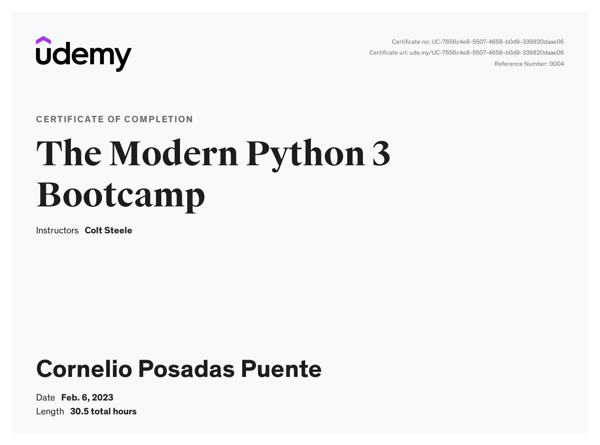

# **The-Modern-Python-3-Bootcamp**
 Course in Udemy about Python 3
 
## Section 1, 2, 3, 4 and 5 are for setting up Python and how to install it, using terminal

## Sections
- [Projects](https://github.com/CornelioEmbedded/The-Modern-Python-3-Bootcamp/tree/main/_Projects)
- [6_Numbers_operators_and_comments](https://github.com/CornelioEmbedded/The-Modern-Python-3-Bootcamp/tree/main/6_NumbersOperatorsAndComments)
- [7_Variables_and_strings](https://github.com/CornelioEmbedded/The-Modern-Python-3-Bootcamp/tree/main/7_Variables_and_strings)
- [8_Boolean_and_conditional_logic](https://github.com/CornelioEmbedded/The-Modern-Python-3-Bootcamp/tree/main/8_Boolean_and_conditional_logic)
- [10_Looping_in_Python](https://github.com/CornelioEmbedded/The-Modern-Python-3-Bootcamp/tree/main/10_Looping_in_Python)
- [12_Lists](https://github.com/CornelioEmbedded/The-Modern-Python-3-Bootcamp/tree/main/12_Lists)
- [13_List_comprehension](https://github.com/CornelioEmbedded/The-Modern-Python-3-Bootcamp/tree/main/13_List_Comprehension)
- [14_Dictionaries](https://github.com/CornelioEmbedded/The-Modern-Python-3-Bootcamp/tree/main/14_Dictionaries)
- [16_Tuples_and_sets](https://github.com/CornelioEmbedded/The-Modern-Python-3-Bootcamp/tree/main/16_Tuples_and_sets)
- [17_Functions_P1](https://github.com/CornelioEmbedded/The-Modern-Python-3-Bootcamp/tree/main/17_Functions_P1)
- [19_Functions_P2](https://github.com/CornelioEmbedded/The-Modern-Python-3-Bootcamp/tree/main/19_Functions_Part_2)
- [20_Lambdas_and_built-in_functions](https://github.com/CornelioEmbedded/The-Modern-Python-3-Bootcamp/tree/main/20_Lambdas_and_Built-In_Functions)
- [21_Debugging_and_error_handling](https://github.com/CornelioEmbedded/The-Modern-Python-3-Bootcamp/tree/main/21_Debugging_and_error_handling)
- [22_Modules](https://github.com/CornelioEmbedded/The-Modern-Python-3-Bootcamp/tree/main/22_Modules)
- [23_Making_HTTP_Request](https://github.com/CornelioEmbedded/The-Modern-Python-3-Bootcamp/tree/main/23_Making_HTTP_Request)
- [24_OOP_P1](https://github.com/CornelioEmbedded/The-Modern-Python-3-Bootcamp/tree/main/24_OOP)
- [25_Deck_of_cards_exercise](https://github.com/CornelioEmbedded/The-Modern-Python-3-Bootcamp/tree/main/25_Deck_Of_Cards_Exercise)
- [26_OOP_P2](https://github.com/CornelioEmbedded/The-Modern-Python-3-Bootcamp/tree/main/26_OOP_2)
- [27_Iterators_and_generators](https://github.com/CornelioEmbedded/The-Modern-Python-3-Bootcamp/tree/main/27_Iterators_and_Generators)
- [28_Decorators](https://github.com/CornelioEmbedded/The-Modern-Python-3-Bootcamp/tree/main/28_Decorators)
- [29_Testing_with_Python](https://github.com/CornelioEmbedded/The-Modern-Python-3-Bootcamp/tree/main/29_Testing_with_Python)
- [30_File_IO](https://github.com/CornelioEmbedded/The-Modern-Python-3-Bootcamp/tree/main/30_File_IO)
- [31_Working_with_CSV_and_pickling](https://github.com/CornelioEmbedded/The-Modern-Python-3-Bootcamp/tree/main/31_Working_with_CSV_and_Pickling)
- [32_Web_Scrapping_with_BeautifulSoup](https://github.com/CornelioEmbedded/The-Modern-Python-3-Bootcamp/tree/main/32_Web_Scraping_with_BeautifilSoup)
- [33_Web_Scraping_Project](https://github.com/CornelioEmbedded/The-Modern-Python-3-Bootcamp/tree/main/33_Web_Scraping_Project)
- [34_Regular_Expressions](https://github.com/CornelioEmbedded/The-Modern-Python-3-Bootcamp/tree/main/34_Regular_Expressions)
- [35_Python_SQL](https://github.com/CornelioEmbedded/The-Modern-Python-3-Bootcamp/tree/main/35_Python_SQL)

## Certificate
